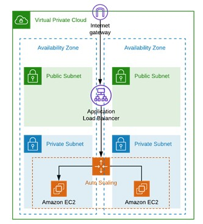
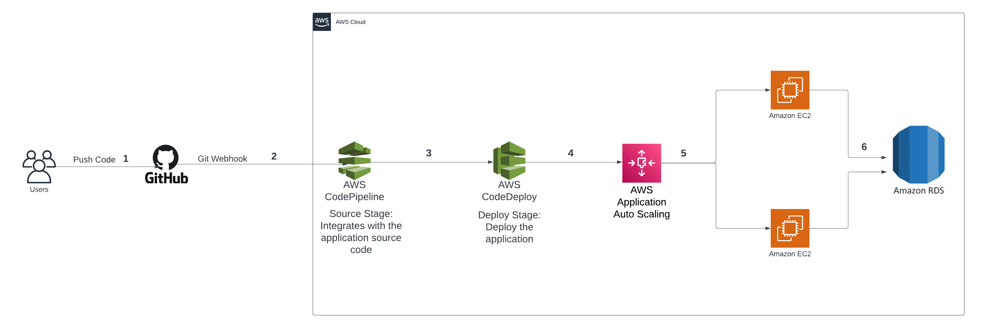
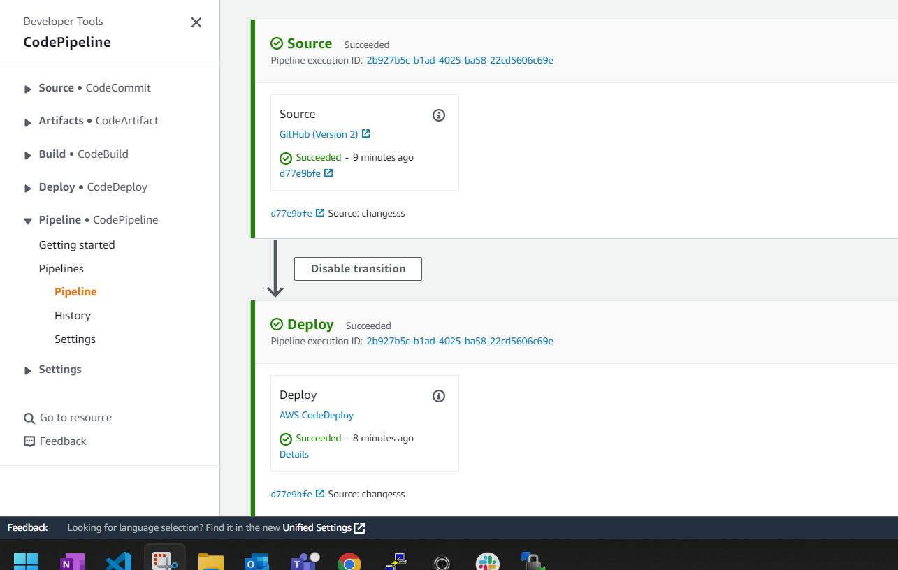
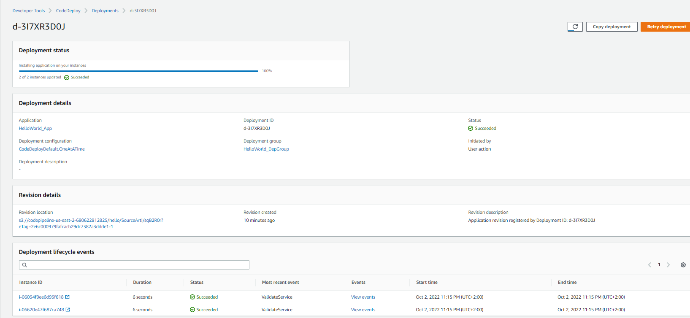
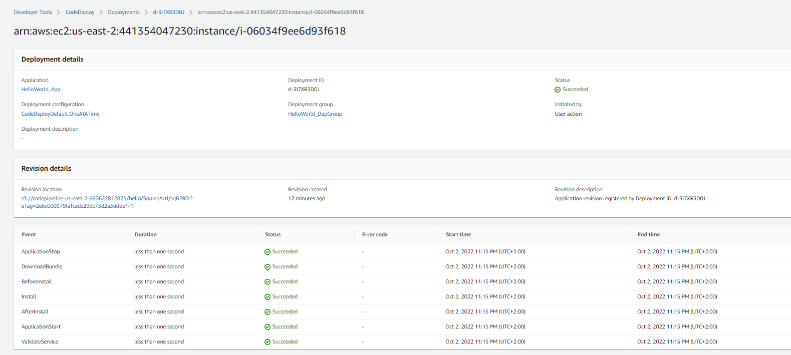
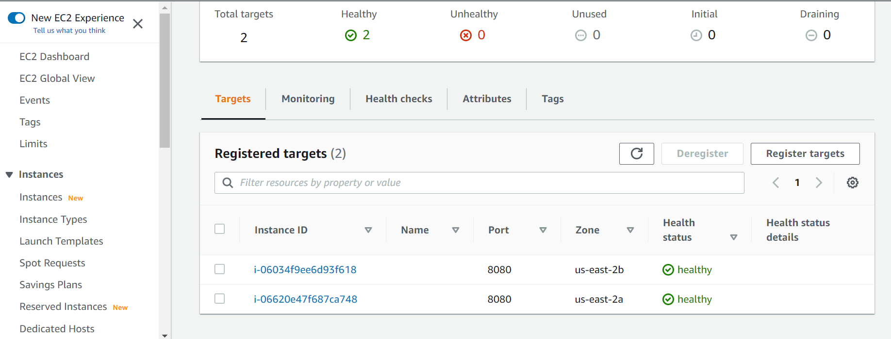
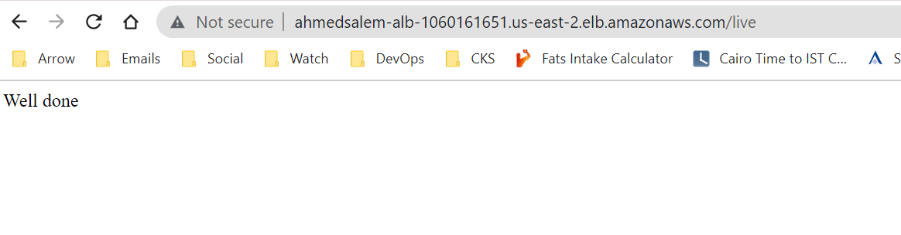

# simple HTTP API that used to connect the our DB solution

## _Description:_
The aim of this challenge is to do the following:

a- Create a networking desgin, compute design, and security desgin on AWS

b- Create a simple HTTP API that used to connect the our DB solution

## _Acceptance Criteria:_
Please do not create a public repo. This challenge is only shared with the interviewers at BespinGlobal MEA, and for obvious reasons we'd like it to remain this way.

## _Architecture:_ 

## _Steps:_

### We will start by creating the infrastructure on AWS as shown below

### 1- Create the Networking module containing the below resources in /terraform/modules/networking_module/main.tf file:  

    (a) VPC

    (b) 2 public subnets in 2 different Availability Zones.
    
    (c) 2 private subnets in 2 different Availability Zones.
    
    (d) Internet Gateway.
    
    (e) Route Tables and Routes.
    
    (f) NAT Gateway.

### 2- Create the ec2 Security Group Module.  
  

### 3- Create the ALB Security Group Module.

### 4- Create the Application Load Balancer (ALB) Module.

### 6- Create the Auto Scaling Group (ASG) Module.

    Add the below commands under launch configuration template userdata to install a stress package to increase the CPU Utilization

        # sudo amazon-linux-extras install epel -y

        # sudo yum install stress -y
        
        # stress -c 4

    Then, check the ASG monitoring tab to see that the CPU will be very high, the activity, and instance management tab.

### 7- Create the RDS Module.

    a- Create RDS instance.

    b- Create AWS secret to store the RDS Creds like username, password, Port.

### 8- Create RDS securityGroup Module.

### Now, we can create a new GitHub Repo for our application.

### 9- Create a nodejs app with following file:
    (a) index.js file that contains the main functions for how to connect with our DB and retrieve the secret value, parse it and use the DB_URI to connect to the RDS.
    
    (b) .env file that has the PORT as an env variables.
    
    (c) appspec.yml file that has the needed hooks to be used by the codeDeply stage in our codePipeline.
    
    (d) before_install.sh file that is used by appspec.yml file.
    
    (e) app_start.sh file that is used by appspec.yml file.

### 10- Create the CodePipeline Module with GitHub source stage and codeDeploy stage.

### 11- when we try to push any updates in our application repo, the pipeline get triggered

### 12- You can now hit the DNS name of the ALB with "/live" endpoint as shown below

        ahmedsalem-ALB-151455209.us-east-2.elb.amazonaws.com/live
        
- if the application was able to connect with a database, you will see an HTML page with "Well done"
- if some error occurred during the connection with the database, you will see an HTML page with "Maintenance"

## _References:_
[Create AWS VPC, NAT, InternetGateway, Routing Tables, Private, and Public Subnets](https://medium.com/appgambit/terraform-aws-vpc-with-private-public-subnets-with-nat-4094ad2ab331)

[Provisioning an Application Load Balancer with Terraform](https://hceris.com/provisioning-an-application-load-balancer-with-terraform/)

[Creating ALB Target group using Terraform](https://registry.terraform.io/providers/hashicorp/aws/latest/docs/resources/lb_target_group)

[ALB now supports the lowest number of outstanding requests routing algorithm for load balancing requests.](https://aws.amazon.com/fr/about-aws/whats-new/2019/11/application-load-balancer-now-supports-least-outstanding-requests-algorithm-for-load-balancing-requests/)

[Resource: aws_cloudwatch_metric_alarm](https://registry.terraform.io/providers/hashicorp/aws/latest/docs/resources/cloudwatch_metric_alarm)

[Stress package to simulate CPU utilization ](https://gist.github.com/mikepfeiffer/d27f5c478bef92e8aff4241154b77e54)